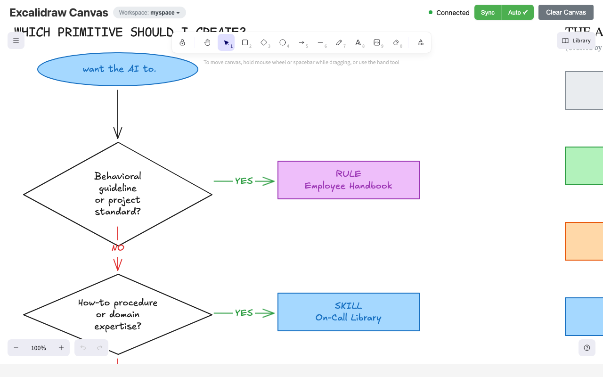
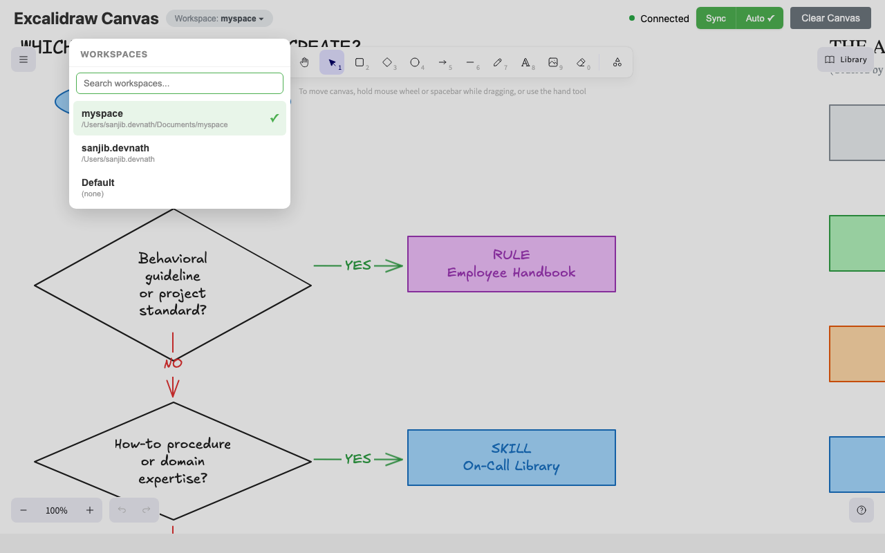
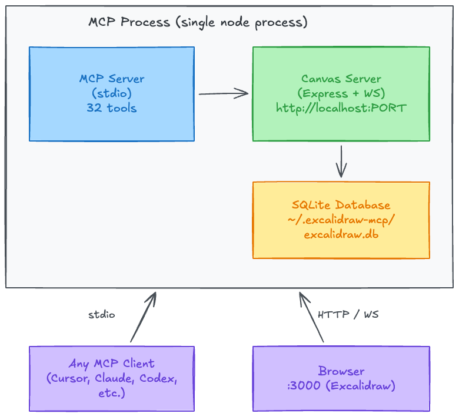

# MCP Excalidraw Local

[](https://github.com/sanjibdevnathlabs/mcp-excalidraw-local/actions/workflows/ci.yml)
[](https://github.com/sanjibdevnathlabs/mcp-excalidraw-local/actions/workflows/docker.yml)
[](LICENSE)

A fully local, self-hosted Excalidraw MCP server with **SQLite persistence**, **multi-tenancy**, and **auto-sync** — designed to run entirely on your machine without depending on `excalidraw.com`.

Run a live Excalidraw canvas and control it from any AI agent. This repo provides:

- **MCP Server**: 32 tools over stdio — works with any MCP-compatible client
- **Agent Skill**: Portable skill with workflow playbooks, cheatsheets, and helper scripts
- **Live Canvas**: Real-time Excalidraw UI synced via WebSocket
- **SQLite Persistence**: Elements survive restarts, with versioning and search
- **Multi-Tenancy**: Isolated canvases per workspace, auto-detected

> **Fork notice:** This project is forked from [yctimlin/mcp_excalidraw](https://github.com/yctimlin/mcp_excalidraw) and extends it with persistence, multi-workspace support, and numerous UX improvements. Full credit to the original author for the excellent foundation. See [What Changed From Upstream](#what-changed-from-upstream) for details.

Keywords: Excalidraw MCP server, AI diagramming, local Excalidraw, self-hosted, SQLite persistence, multi-tenant, Mermaid to Excalidraw.

## Screenshots

### Canvas UI

The live Excalidraw canvas with toolbar, connection status, sync controls, and workspace badge:



### Workspace Switcher

Click the workspace badge to switch between isolated canvases — each workspace has its own set of diagrams:



> For a demo of the upstream project (before persistence/multi-tenancy), see the [original video by @yctimlin](https://youtu.be/ufW78Amq5qA).

## Table of Contents

- [Screenshots](#screenshots)
- [What It Is](#what-it-is)
- [How We Differ from the Official Excalidraw MCP](#how-we-differ-from-the-official-excalidraw-mcp)
- [What Changed From Upstream](#what-changed-from-upstream)
- [What's New](#whats-new)
- [Architecture](#architecture)
- [Quick Start](#quick-start)
- [Quick Start (Docker)](#quick-start-docker)
- [Configuration](#configuration)
- [Environment Variables](#environment-variables)
- [Multi-Tenancy (Workspaces)](#multi-tenancy-workspaces)
- [Agent Skill (Optional)](#agent-skill-optional)
- [MCP Tools (32 Total)](#mcp-tools-32-total)
- [Testing](#testing)
- [Troubleshooting](#troubleshooting)
- [Known Issues / TODO](#known-issues--todo)
- [Development](#development)
- [Credits](#credits)

## What It Is

This MCP server gives AI agents a full canvas toolkit to build, inspect, and iteratively refine Excalidraw diagrams — including the ability to see what they drew.

The repo contains a single Node.js process that runs:

- **MCP server** (stdio): 32 tools for element CRUD, layout, scene awareness, file I/O, snapshots, search, multi-tenancy, and more
- **Canvas server** (embedded): web UI + REST API + WebSocket updates at `http://localhost:<CANVAS_PORT>`
- **SQLite database**: persistent storage at `~/.excalidraw-mcp/excalidraw.db`

## How We Differ from the Official Excalidraw MCP

Excalidraw now has an [official MCP](https://github.com/excalidraw/excalidraw-mcp) — it's great for quick, prompt-to-diagram generation rendered inline in chat. We solve a different problem.

| | Official Excalidraw MCP | This Project |
|---|---|---|
| **Approach** | Prompt in, diagram out (one-shot) | Programmatic element-level control (32 tools) |
| **State** | Stateless — each call is independent | Persistent live canvas with real-time sync |
| **Storage** | None | SQLite with WAL mode, versioning, element history |
| **Multi-tenancy** | No | Workspace-based isolation, auto-detected |
| **Element CRUD** | No | Full create / read / update / delete per element |
| **AI sees the canvas** | No | `describe_scene` (structured text) + `get_canvas_screenshot` (image) |
| **Iterative refinement** | No — regenerate the whole diagram | Draw → look → adjust → look again, element by element |
| **Layout tools** | No | `align_elements`, `distribute_elements`, `group / ungroup` |
| **File I/O** | No | `export_scene` / `import_scene` (.excalidraw JSON) |
| **Snapshot & rollback** | No | `snapshot_scene` / `restore_snapshot` |
| **Mermaid conversion** | No | `create_from_mermaid` |
| **Search** | No | `search_elements` — full-text search across labels |
| **Design guide** | `read_me` cheat sheet | `read_diagram_guide` (colors, sizing, layout, anti-patterns) |
| **Viewport control** | Camera animations | `set_viewport` (zoom-to-fit, center on element, manual zoom) |
| **Live canvas UI** | Rendered inline in chat | Standalone Excalidraw app synced via WebSocket |
| **Multi-agent** | Single user | Multiple agents can draw on the same canvas concurrently |
| **Works without MCP** | No | Yes — REST API fallback via agent skill |

**TL;DR** — The official MCP generates diagrams. We give AI agents a full canvas toolkit to build, inspect, and iteratively refine diagrams — including the ability to see what they drew.

## What Changed From Upstream

This fork extends [yctimlin/mcp_excalidraw](https://github.com/yctimlin/mcp_excalidraw) with the following enhancements:

| Area | Upstream | This Fork |
|---|---|---|
| **Storage** | In-memory (lost on restart) | SQLite with WAL mode, versioning, element history |
| **Multi-tenancy** | None | Workspace-based tenant isolation (auto-detected via `server.listRoots()`) |
| **Canvas lifecycle** | Separate process (2 terminals) | Embedded in MCP process (single `node dist/index.js`) |
| **Auto-sync** | Manual "Sync to Backend" button | Debounced auto-sync (3s idle) with manual override |
| **Canvas port** | Hardcoded 3000 | Configurable via `CANVAS_PORT` env var |
| **MCP tools** | 26 | 32 (added search, history, tenants, projects) |
| **Workspace switcher** | None | Dropdown with search in canvas UI |
| **Sync normalization** | Bound text breaks on reload | Elements normalized to MCP format before storage |
| **Projects** | None | Multiple projects per tenant |
| **Element history** | None | Full version history per element |
| **Search** | None | Full-text search across elements |

### New MCP Tools (6 added)

| Tool | Description |
|---|---|
| `search_elements` | Full-text search across element labels and text |
| `element_history` | View version history for any element |
| `list_projects` | List projects within the active tenant |
| `switch_project` | Switch between projects |
| `list_tenants` | List all workspace tenants |
| `switch_tenant` | Switch the active workspace tenant |

## What's New

### v3.0 — This Fork (Persistence & Multi-Tenancy)

- **SQLite persistence**: Elements, projects, tenants, snapshots, and element versions stored in `~/.excalidraw-mcp/excalidraw.db` with WAL mode and `busy_timeout` for multi-process safety
- **Multi-tenancy**: Each workspace gets an isolated canvas. Tenant auto-detected from workspace path via `server.listRoots()`. UI dropdown with search for switching workspaces
- **Embedded canvas**: Canvas server runs inside the MCP process — single `node dist/index.js` starts everything, stops together
- **Auto-sync with debounce**: Canvas changes are automatically persisted after 3s of inactivity. Manual sync button as fallback. Toggle auto-sync on/off
- **Configurable port**: `CANVAS_PORT` env var (default `3000`)
- **Sync normalization**: Excalidraw's internal bound-text representation is normalized to MCP format before storage, preventing text overflow/detachment on reload
- **6 new MCP tools**: `search_elements`, `element_history`, `list_projects`, `switch_project`, `list_tenants`, `switch_tenant`
- **Updated agent skill**: Comprehensive workflow playbook with iterative write-check-review cycle, sizing rules, anti-patterns, and quality checklist
- **Workspace switcher UI**: Click "Workspace: ..." badge to search and switch between workspaces

### v2.0 — Canvas Toolkit (upstream)

- 13 new MCP tools (26 total): `get_element`, `clear_canvas`, `export_scene`, `import_scene`, `export_to_image`, `duplicate_elements`, `snapshot_scene`, `restore_snapshot`, `describe_scene`, `get_canvas_screenshot`, `read_diagram_guide`, `export_to_excalidraw_url`, `set_viewport`
- **Closed feedback loop**: AI can now inspect the canvas (`describe_scene`) and see it (`get_canvas_screenshot` returns an image) — enabling iterative refinement
- **Design guide**: `read_diagram_guide` returns best-practice color palettes, sizing rules, layout patterns, and anti-patterns
- **Viewport control**: `set_viewport` with `scrollToContent`, `scrollToElementId`, or manual zoom/offset
- **File I/O**: export/import full `.excalidraw` JSON files
- **Snapshots**: save and restore named canvas states
- **Skill fallback**: Agent skill auto-detects MCP vs REST API mode
- Fixed all previously known issues: `align_elements` / `distribute_elements` fully implemented, points type normalization, removed invalid `label` type, `ungroup_elements` now errors on failure

### v1.x (upstream)

- Agent skill: `skills/excalidraw-skill/` (portable instructions + helper scripts for export/import and repeatable CRUD)
- Better testing loop: MCP Inspector CLI examples + browser screenshot checks
- Bugfixes: batch create now preserves element ids (fixes update/delete after batch); frontend entrypoint fixed

## Architecture



- **Single process**: The MCP server embeds the canvas server. Starting the MCP starts both; stopping it stops both.
- **SQLite**: Stored at `~/.excalidraw-mcp/excalidraw.db` by default. WAL mode + `busy_timeout` for multi-process safety.
- **Multi-tenancy**: Each workspace gets an isolated tenant (SHA-256 hash of workspace path). The UI shows a workspace switcher dropdown with search.

## Quick Start

### Option A: NPM (recommended)

```bash
npx @sanjibdevnath/mcp-excalidraw-local
```

Or install globally:

```bash
npm install -g @sanjibdevnath/mcp-excalidraw-local
mcp-excalidraw-local
```

### Option B: From source

**Prerequisites:** Node >= 18, npm or pnpm

```bash
git clone https://github.com/sanjibdevnathlabs/mcp-excalidraw-local.git
cd mcp-excalidraw-local

# Install dependencies (pnpm or npm)
pnpm install
pnpm rebuild better-sqlite3 esbuild

# Build frontend + server
pnpm run build
```

The MCP server is typically started by your MCP client — see [Configuration](#configuration). To run manually:

```bash
node dist/index.js
```

This starts the MCP server (stdio) **and** the canvas server. Open `http://localhost:3000` in your browser.

## Quick Start (Docker)

Canvas server:
```bash
docker run -d -p 3000:3000 --name mcp-excalidraw-canvas sanjibdevnath/mcp-excalidraw-local-canvas:latest
```

MCP server (stdio) is typically launched by your MCP client. If you want a local container, use `sanjibdevnath/mcp-excalidraw-local:latest`.

## Configuration

This is a standard MCP server communicating over **stdio**. It works with any MCP-compatible client (Cursor, Claude Desktop, Claude Code, Codex CLI, OpenCode, Gemini, or any other agent that supports the Model Context Protocol).

### JSON config (most clients)

Add this to your client's MCP configuration file:

```json
{
  "mcpServers": {
    "excalidraw-canvas": {
      "command": "node",
      "args": ["/absolute/path/to/mcp-excalidraw-local/dist/index.js"],
      "env": {
        "CANVAS_PORT": "3000"
      }
    }
  }
}
```

Replace `/absolute/path/to/mcp-excalidraw-local` with the actual path where you cloned and built the repo.

### CLI-based registration

```bash
# Example for Claude Code
claude mcp add excalidraw-canvas --scope user \
  -e CANVAS_PORT=3000 \
  -- node /absolute/path/to/mcp-excalidraw-local/dist/index.js
```

### Docker

```json
{
  "mcpServers": {
    "excalidraw-canvas": {
      "command": "docker",
      "args": [
        "run", "-i", "--rm",
        "-e", "CANVAS_PORT=3000",
        "sanjibdevnath/mcp-excalidraw-local:latest"
      ]
    }
  }
}
```

> **Note:** For Docker on Linux, you may need `--add-host=host.docker.internal:host-gateway`.

### Key points

- **Single process** — The canvas server is embedded. No separate terminal or process needed.
- **Browser required for screenshots** — `export_to_image` and `get_canvas_screenshot` rely on the frontend. Open `http://localhost:3000` in a browser.

## Environment Variables

| Variable | Description | Default |
|----------|-------------|---------|
| `CANVAS_PORT` | Port for the embedded canvas server | `3000` |
| `EXCALIDRAW_DB_PATH` | Path to the SQLite database file | `~/.excalidraw-mcp/excalidraw.db` |
| `EXCALIDRAW_EXPORT_DIR` | Allowed directory for file exports | `process.cwd()` |
| `EXPRESS_SERVER_URL` | Canvas server URL (only if running canvas separately) | `http://localhost:3000` |
| `ENABLE_CANVAS_SYNC` | Enable real-time canvas sync | `true` |

## Multi-Tenancy (Workspaces)

Each workspace (codebase) gets an isolated canvas. The tenant is identified by a SHA-256 hash of the workspace path.

### How it works

1. **Auto-detection**: When the MCP starts, it calls `server.listRoots()` to get the actual workspace path from the MCP client. This is hashed to create a unique tenant ID.
2. **Per-request scoping**: Every HTTP request includes an `X-Tenant-Id` header. The canvas server uses this to scope all CRUD operations to the correct tenant.
3. **UI switcher**: The canvas UI shows a "Workspace: &lt;name&gt;" badge. Click it to open a dropdown with all known workspaces, complete with search.
4. **Multi-instance safe**: SQLite WAL mode with `busy_timeout = 5000ms` handles concurrent access from multiple client instances.

### Projects within a tenant

Each tenant can have multiple projects (collections of elements). Use the `list_projects` and `switch_project` MCP tools, or manage via the REST API.

## Agent Skill (Optional)

This repo includes a skill at `skills/excalidraw-skill/` that provides:

- **Workflow playbook** (`SKILL.md`): step-by-step guidance for drawing, refining, and exporting diagrams — including an iterative write-check-review cycle, sizing rules, color palettes, and anti-patterns
- **Cheatsheet** (`references/cheatsheet.md`): MCP tool and REST API reference for all 32 tools
- **Helper scripts** (`scripts/*.cjs`): export, import, clear, healthcheck, CRUD operations

The skill complements the MCP server by giving your AI agent structured workflows to follow.

### Install the Skill

Copy the skill folder to your agent's skill directory:

```bash
# Claude Code
mkdir -p ~/.claude/skills
cp -R skills/excalidraw-skill ~/.claude/skills/excalidraw-skill

# Cursor
mkdir -p ~/.cursor/skills
cp -R skills/excalidraw-skill ~/.cursor/skills/excalidraw-skill

# Codex CLI
mkdir -p ~/.codex/skills
cp -R skills/excalidraw-skill ~/.codex/skills/excalidraw-skill

# Or any agent that supports a skills directory
cp -R skills/excalidraw-skill /path/to/your/agent/skills/
```

To update an existing installation, remove the old folder first then re-copy.

### Use the Skill Scripts

All scripts respect `EXPRESS_SERVER_URL` (default `http://localhost:3000`) or accept `--url`.

```bash
EXPRESS_SERVER_URL=http://127.0.0.1:3000 node skills/excalidraw-skill/scripts/healthcheck.cjs
EXPRESS_SERVER_URL=http://127.0.0.1:3000 node skills/excalidraw-skill/scripts/export-elements.cjs --out diagram.elements.json
EXPRESS_SERVER_URL=http://127.0.0.1:3000 node skills/excalidraw-skill/scripts/import-elements.cjs --in diagram.elements.json --mode batch
```

### When the Skill Is Useful

- **Repository workflow**: export elements as JSON, commit it, and re-import later
- **Reliable refactors**: clear + re-import in `sync` mode to make canvas match a file
- **Automated smoke tests**: create/update/delete a known element to validate a deployment
- **Repeatable diagrams**: keep a library of element JSON snippets and import them

See `skills/excalidraw-skill/SKILL.md` and `skills/excalidraw-skill/references/cheatsheet.md`.

## MCP Tools (32 Total)

| Category | Tools |
|---|---|
| **Element CRUD** | `create_element`, `get_element`, `update_element`, `delete_element`, `query_elements`, `batch_create_elements`, `duplicate_elements` |
| **Layout** | `align_elements`, `distribute_elements`, `group_elements`, `ungroup_elements`, `lock_elements`, `unlock_elements` |
| **Scene Awareness** | `describe_scene`, `get_canvas_screenshot` |
| **File I/O** | `export_scene`, `import_scene`, `export_to_image`, `export_to_excalidraw_url`, `create_from_mermaid` |
| **State Management** | `clear_canvas`, `snapshot_scene`, `restore_snapshot` |
| **Viewport** | `set_viewport` |
| **Design Guide** | `read_diagram_guide` |
| **Resources** | `get_resource` |
| **Search & History** | `search_elements`, `element_history` |
| **Multi-Tenancy** | `list_tenants`, `switch_tenant` |
| **Projects** | `list_projects`, `switch_project` |

Full schemas are discoverable via `tools/list` or in `skills/excalidraw-skill/references/cheatsheet.md`.

## Testing

### Health check

```bash
curl http://localhost:3000/health
```

### MCP Inspector

List tools:
```bash
npx @modelcontextprotocol/inspector --cli \
  -e CANVAS_PORT=3000 -- \
  node dist/index.js --method tools/list
```

Create a rectangle:
```bash
npx @modelcontextprotocol/inspector --cli \
  -e CANVAS_PORT=3000 -- \
  node dist/index.js --method tools/call --tool-name create_element \
  --tool-arg type=rectangle --tool-arg x=100 --tool-arg y=100 \
  --tool-arg width=300 --tool-arg height=200
```

### Frontend Screenshots

If you use a browser automation tool for UI checks:
```bash
# Open the canvas and take a screenshot for verification
open http://127.0.0.1:3000
# Or use agent-browser, Playwright, Puppeteer, etc.
```

## Troubleshooting

- **Canvas not loading**: Ensure `CANVAS_PORT` isn't occupied by another process. Check `lsof -i :3000`.
- **Canvas not updating**: Confirm the MCP process is running and the browser is connected (check the status dot in the header).
- **Wrong workspace shown**: The MCP uses `server.listRoots()` to detect the workspace. Restart your MCP client if the workspace changed.
- **Elements missing after restart**: Check `~/.excalidraw-mcp/excalidraw.db` exists. If you previously ran the upstream (in-memory) version, data wasn't persisted.
- **Port conflict with multiple instances**: Set different `CANVAS_PORT` values for each workspace, or rely on multi-tenancy (same port, different tenants).
- **Updates/deletes fail after batch creation**: Ensure you are on a build that includes the batch id preservation fix.

## Known Issues / TODO

All previously listed bugs from the upstream have been fixed. Remaining items:

- [ ] **Image export requires a browser**: `export_to_image` and `get_canvas_screenshot` rely on the frontend rendering. The canvas UI must be open in a browser.
- [ ] **`export_to_excalidraw_url` blocked**: Organizations that block `excalidraw.com` cannot use shareable URL export. Use `export_scene` for local `.excalidraw` files instead.

Contributions welcome!

## Development

```bash
# Type check
pnpm run type-check

# Full build (frontend + server)
pnpm run build

# Dev mode (watch)
pnpm run dev
```

### Database

SQLite database: `~/.excalidraw-mcp/excalidraw.db`

Override with `EXCALIDRAW_DB_PATH` environment variable.

### REST API

The canvas server exposes a REST API alongside the WebSocket interface:

| Method | Endpoint | Description |
|--------|----------|-------------|
| GET | `/health` | Health check |
| GET | `/api/elements` | List all elements |
| POST | `/api/elements` | Create an element |
| PUT | `/api/elements/:id` | Update an element |
| DELETE | `/api/elements/:id` | Delete an element |
| POST | `/api/elements/sync` | Sync all elements (bulk upsert) |
| GET | `/api/tenants` | List all tenants |
| GET | `/api/tenant/active` | Get the active tenant |
| PUT | `/api/tenant/active` | Set the active tenant |

All endpoints accept an `X-Tenant-Id` header for per-request tenant scoping.

## Credits

This project is forked from [yctimlin/mcp_excalidraw](https://github.com/yctimlin/mcp_excalidraw) — an excellent Excalidraw MCP server with a live canvas, 26 tools, real-time WebSocket sync, Mermaid conversion, and a comprehensive agent skill. Full credit to [@yctimlin](https://github.com/yctimlin) for the original design and implementation.

This fork adds SQLite persistence, multi-tenancy, auto-sync, embedded canvas lifecycle, and workspace management on top of that foundation.

Licensed under [MIT](LICENSE).
