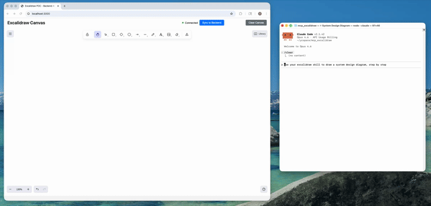

# Excalidraw MCP Server, CLI & Agent Skill

[](https://github.com/yctimlin/mcp_excalidraw/actions/workflows/ci.yml)
[](https://github.com/yctimlin/mcp_excalidraw/actions/workflows/docker.yml)
[](https://www.npmjs.com/package/mcp-excalidraw-server)
[](LICENSE)

**mcp-excalidraw-server** gives AI agents a live [Excalidraw](https://excalidraw.com) canvas they can draw on, look at, refine, and save into your repo. Your agent creates architecture diagrams and flowcharts programmatically, **sees its own work via screenshots**, fixes layout problems, and exports `.excalidraw` files you can commit next to your code.

One canvas, three ways to drive it:

- **Agent Skill + CLI** — recommended for coding agents (Claude Code, Codex CLI, Cursor, OpenCode): `npx -y mcp-excalidraw-server <command>`. Zero config, auto-starts the canvas, composable JSON in/out.
- **MCP Server** — 26 tools over stdio for any Model Context Protocol client (Claude Desktop, Cursor, Codex CLI, Antigravity, ...).
- **REST API** — plain HTTP for LangChain and custom frameworks.

Core drawing runs fully local (Node ≥ 18, MIT licensed) — no API keys. Mermaid conversion runs in the local browser canvas; `share` is optional and uploads an encrypted scene to excalidraw.com.

## Demo



*AI agent creates a complete architecture diagram from a single prompt (4x speed). [Watch full video on YouTube](https://youtu.be/ufW78Amq5qA)*

## Table of Contents

- [Demo](#demo)
- [What It Is](#what-it-is)
- [How We Differ from the Official Excalidraw MCP](#how-we-differ-from-the-official-excalidraw-mcp)
- [What's New](#whats-new)
- [Installation](#installation)
- [Agent Skill](#agent-skill)
- [CLI Reference](#cli-reference)
- [Configure MCP Clients](#configure-mcp-clients)
  - [Claude Desktop](#claude-desktop)
  - [Claude Code](#claude-code)
  - [Cursor](#cursor)
  - [Codex CLI](#codex-cli)
  - [OpenCode](#opencode)
  - [Antigravity (Google)](#antigravity-google)
- [MCP Tools (26 Total)](#mcp-tools-26-total)
- [Quick Start (From Source / Docker)](#quick-start-from-source--docker)
- [Testing](#testing)
- [FAQ](#faq)
- [Troubleshooting](#troubleshooting)
- [Known Issues / TODO](#known-issues--todo)
- [Development](#development)
- [License](#license)

## What It Is

Ask your agent to *"draw the architecture of this service"* and it produces a real, editable Excalidraw diagram — not a one-shot image. Because the agent can query, screenshot, and update individual elements, it iterates until labels fit, nothing overlaps, and arrows route cleanly; then it exports the result as a `.excalidraw` file that lives in your repo and gets updated when the code changes.

Under the hood there are two processes, one product:

- **Canvas server**: Excalidraw web UI + REST API + WebSocket real-time sync (default `http://127.0.0.1:3000`)
- **A thin front-end of your choice**: the CLI, the MCP stdio server, or raw HTTP — all drive the same canvas

Since v1.1 the canvas server starts itself: canvas-driving CLI commands (and the MCP server on launch) auto-spawn it if nothing is listening. `status` only inspects the current server state. Set `EXCALIDRAW_NO_AUTOSTART=1` to opt out.

## How We Differ from the Official Excalidraw MCP

Excalidraw has an [official MCP](https://github.com/excalidraw/excalidraw-mcp) — a chat widget that streams a diagram inline from a single prompt (the model gets two tools: a format reference and `create_view`). It's great for "draw me a cat" in Claude or ChatGPT. We solve a different problem: giving *coding agents* a persistent canvas workbench.

| | Official Excalidraw MCP | This Project |
|---|---|---|
| **Approach** | Prompt in, diagram out (one-shot widget) | Programmatic element-level control (CLI + 26 MCP tools) |
| **State** | Checkpoints inside the chat widget | Persistent live canvas with real-time sync |
| **Element CRUD** | Declarative re-send with delete markers | Full create / read / update / delete per element |
| **AI sees the canvas** | No | `describe` (structured text) + `screenshot` (image) |
| **Iterative refinement** | Regenerate from checkpoint | Draw → look → adjust → look again, element by element |
| **Layout tools** | No | align, distribute, group / ungroup, lock, duplicate |
| **File I/O** | No model-facing export | `.excalidraw` export/import — diagrams as repo artifacts |
| **Snapshot & rollback** | Widget-side checkpoints | Named server-side snapshots |
| **Mermaid conversion** | No | `mermaid` / `create_from_mermaid` |
| **Shareable URLs** | Widget-only | `share` / `export_to_excalidraw_url` |
| **Works without MCP** | No | Yes — CLI + agent skill + REST API |
| **Multi-agent** | Single chat | Multiple agents on the same canvas concurrently |

**TL;DR** — The official MCP shows Excalidraw diagrams in your chat. This project gives your coding agent a full Excalidraw workbench: a canvas it can draw on, inspect, refine, and commit to your repo.

## What's New

Current package version: **1.1.0**. The current release line is **v1.1 — CLI-First**.

### v1.1 — CLI-First

- **First-class CLI**: every capability is now a composable command — `npx -y mcp-excalidraw-server add|query|describe|screenshot|export|import|mermaid|snapshot|arrange|share|...` — JSON on stdout, meaningful exit codes. Also installed as the `excalidraw-canvas` alias.
- **Zero-setup**: canvas-driving CLI commands and the MCP server **auto-start the canvas server** if it isn't running (closes #66). Opt out with `EXCALIDRAW_NO_AUTOSTART=1`.
- **`apply`**: multi-op patches (`{"create":[...],"update":[{"id":"a","set":{...}}],"delete":[...]}`) in a single invocation.
- **`install-skill`**: `npx -y mcp-excalidraw-server install-skill` drops the agent skill into `~/.claude/skills` (or `--target codex|<dir>`), cleanly replacing older versions.
- **Skill is now CLI-first** and no longer needs a cloned repo or configured MCP server to work.
- **Typed queries**: `query --filter locked=true --filter label.text=API` — booleans, numbers, and nested keys work.
- **Internals**: shared core library (`src/core/`) behind both the CLI and MCP server; canvas `groupIds` are the source of truth for grouping (ungroup now works across restarts); `node-fetch` dropped; MCP version metadata derived from `package.json`; canvas server writes a pidfile and shuts down cleanly.

## Installation

The only prerequisite is **Node.js ≥ 18**.

### Easiest: let Claude Code or Codex install it

Copy this into Claude Code or Codex CLI — it installs, verifies, and draws a test diagram:

```text
Install the Excalidraw canvas toolkit so you can draw diagrams for me:

1. Run: npx -y mcp-excalidraw-server install-skill
   (add --target codex if you are Codex CLI; the default installs to ~/.claude/skills)
2. Read the installed SKILL.md so you know the drawing workflow.
3. Start the canvas with: npx -y mcp-excalidraw-server start
   then tell me to open http://127.0.0.1:3000 in my browser (screenshots need an open tab).
4. Draw a small test diagram — two labeled boxes connected by an arrow — take a
   screenshot, and show me the result to confirm everything works.
```

### Manual install

| You are... | Install with | Then |
|---|---|---|
| **Claude Code user** | `npx -y mcp-excalidraw-server install-skill` | Ask Claude Code to draw — the skill handles the rest |
| **Codex CLI user** | `npx -y mcp-excalidraw-server install-skill --target codex` | Ask Codex to draw — the skill handles the rest |
| **MCP client user** (Claude Desktop, Cursor, ...) | Add the npx config below | See [Configure MCP Clients](#configure-mcp-clients) |
| **CLI user / scripting** | Nothing — `npx -y mcp-excalidraw-server <command>` | See [CLI Reference](#cli-reference) |
| **Contributor / from source** | `git clone` + `npm ci` + `npm run build` | See [Quick Start (From Source / Docker)](#quick-start-from-source--docker) |

There is no separate server setup: any drawing command auto-starts the local canvas server on `http://127.0.0.1:3000`.

### 60-Second Quick Start (CLI)

No clone, no config:

```bash
# start the canvas (drawing commands auto-start it too) and open it
npx -y mcp-excalidraw-server start
open http://127.0.0.1:3000   # browser tab enables screenshots & mermaid

# draw something
echo '[
  {"id":"api","type":"rectangle","x":100,"y":100,"width":160,"height":80,"text":"API Server","backgroundColor":"#a5d8ff"},
  {"id":"db","type":"rectangle","x":400,"y":100,"width":160,"height":80,"text":"Database","backgroundColor":"#99e9f2"},
  {"type":"arrow","x":0,"y":0,"startElementId":"api","endElementId":"db","text":"SQL"}
]' | npx -y mcp-excalidraw-server add

# let your agent see its work
npx -y mcp-excalidraw-server describe
npx -y mcp-excalidraw-server screenshot --out diagram.png

# diagrams as repo artifacts
mkdir -p docs
npx -y mcp-excalidraw-server export --out docs/architecture.excalidraw
```

Give your agent the full playbook:

```bash
npx -y mcp-excalidraw-server install-skill            # → ~/.claude/skills (Claude Code)
npx -y mcp-excalidraw-server install-skill --target codex   # → ~/.codex/skills
```

> **Security note:** The canvas server binds `127.0.0.1` only by default. If you expose it on a network interface (`HOST=0.0.0.0`), put network-level access controls in front — the API has no built-in authentication.

## Agent Skill

The skill at `skills/excalidraw-skill/` teaches agents the full workflow — layout planning, the screenshot-verify-fix quality loop, arrow routing, anti-patterns, snapshots, and file I/O. It works through the CLI (preferred, zero setup), MCP tools (if configured), or raw REST — in that order.

```bash
npx -y mcp-excalidraw-server install-skill [--target claude|codex|<dir>]
```

Then invoke it in Claude Code with `/excalidraw-skill` (or let the agent trigger it by task description). Re-running `install-skill` upgrades in place — it replaces the target directory, so files removed upstream don't linger.

Where the skill shines:

- **Diagrams as code artifacts**: export `.excalidraw` files into the repo, commit them, re-import + refine when the architecture changes.
- **Self-verifying diagrams**: the agent screenshots its own work and fixes truncation/overlap before calling it done.
- **No-MCP environments**: CI jobs, plain shells, and frameworks get the same capabilities through the CLI.

## CLI Reference

`npx -y mcp-excalidraw-server <command>` or (after `npm i -g mcp-excalidraw-server`) `excalidraw-canvas <command>`.

Conventions: JSON results on stdout — except `describe` (plain text by design) and raw-content output when `--out` is omitted (`export` prints the scene JSON, `screenshot --format svg` prints SVG). Diagnostics on stderr. Exit codes: `0` ok, `1` error, `2` usage, `3` canvas unreachable, `4` browser tab required. Canvas URL from `EXPRESS_SERVER_URL` or `--url`. Canvas-driving commands auto-start the server; `status` only reports current state. Explicit `start` overrides the `EXCALIDRAW_NO_AUTOSTART=1` opt-out (it's user intent, not auto-start).

| Command | Description |
|---------|-------------|
| `start` / `stop` / `status` | Manage the canvas server (detached; `stop` identity-checks the live server via `/health` before signaling) |
| `add [file\|-]` | Batch-create elements from a JSON array (file or stdin); `--one '{...}'` for a single element |
| `apply [file\|-]` | One-call multi-op patch: `{"create":[...],"update":[{"id":"a","set":{...}}],"delete":["id"]}` |
| `get <id>` / `delete <id...>` | Read / remove elements |
| `update <id> --set '{...}'` | Update an element |
| `query` | `--type`, `--bbox x0,y0,x1,y1`, `--filter k=v` (typed, nested keys), `--filter-json '{...}'` |
| `describe` | AI-readable scene summary (plain text) |
| `screenshot` | `--out f.png`, `--format png\|svg`, `--no-background` (browser tab required) |
| `export [--out f.excalidraw]` / `import [file\|-] [--replace]` | Scene file I/O |
| `mermaid [file\|-]` | Mermaid → canvas (browser tab required) |
| `snapshot save\|list\|restore <name>` | Named snapshots |
| `arrange align\|distribute\|group\|ungroup\|lock\|unlock\|duplicate` | Layout ops (`--ids a,b,c`, `--to left\|horizontal\|...`) |
| `share` | Encrypted upload → shareable excalidraw.com URL |
| `clear --yes` | Wipe the canvas |
| `install-skill [--target ...]` | Install the agent skill |

Labels and arrow bindings use the agent-friendly format everywhere in the CLI: `"text"` on any shape, `"startElementId"`/`"endElementId"` on arrows — normalization is automatic.

## Configure MCP Clients

The MCP server runs over stdio. Since v1.1 the simplest config is `npx` — no clone, no absolute paths, and the canvas auto-starts:

### Environment Variables

| Variable | Description | Default |
|----------|-------------|---------|
| `EXPRESS_SERVER_URL` | URL of the canvas server | `http://127.0.0.1:3000` |
| `ENABLE_CANVAS_SYNC` | Enable real-time canvas sync | `true` |
| `EXCALIDRAW_NO_AUTOSTART` | Set `1` to disable canvas auto-start | (unset) |
| `EXCALIDRAW_EXPORT_DIR` | Base directory MCP file exports may write to | current working dir |
| `PORT` / `HOST` | Canvas server bind address | `3000` / `127.0.0.1` |

---

### Claude Desktop

Config location:
- macOS: `~/Library/Application Support/Claude/claude_desktop_config.json`
- Windows: `%APPDATA%\Claude\claude_desktop_config.json`
- Linux: `~/.config/Claude/claude_desktop_config.json`

**npx (recommended)**
```json
{
  "mcpServers": {
    "excalidraw": {
      "command": "npx",
      "args": ["-y", "mcp-excalidraw-server"]
    }
  }
}
```

**Local (node)**
```json
{
  "mcpServers": {
    "excalidraw": {
      "command": "node",
      "args": ["/absolute/path/to/mcp_excalidraw/dist/index.js"],
      "env": {
        "EXPRESS_SERVER_URL": "http://127.0.0.1:3000",
        "ENABLE_CANVAS_SYNC": "true"
      }
    }
  }
}
```

**Docker**
```json
{
  "mcpServers": {
    "excalidraw": {
      "command": "docker",
      "args": [
        "run", "-i", "--rm",
        "-e", "EXPRESS_SERVER_URL=http://host.docker.internal:3000",
        "-e", "ENABLE_CANVAS_SYNC=true",
        "ghcr.io/yctimlin/mcp_excalidraw:latest"
      ]
    }
  }
}
```

---

### Claude Code

**npx (recommended)**
```bash
claude mcp add excalidraw --scope user -- npx -y mcp-excalidraw-server
```

> Tip: for coding agents, the skill + CLI often beats MCP config entirely — `npx -y mcp-excalidraw-server install-skill` and you're done.

**Local (node)** - User-level (available across all projects):
```bash
claude mcp add excalidraw --scope user \
  -e EXPRESS_SERVER_URL=http://127.0.0.1:3000 \
  -e ENABLE_CANVAS_SYNC=true \
  -- node /absolute/path/to/mcp_excalidraw/dist/index.js
```

**Docker**
```bash
claude mcp add excalidraw --scope user \
  -- docker run -i --rm \
  -e EXPRESS_SERVER_URL=http://host.docker.internal:3000 \
  -e ENABLE_CANVAS_SYNC=true \
  ghcr.io/yctimlin/mcp_excalidraw:latest
```

**Manage servers:**
```bash
claude mcp list              # List configured servers
claude mcp remove excalidraw # Remove a server
```

---

### Cursor

Config location: `.cursor/mcp.json` in your project root (or `~/.cursor/mcp.json` for global config)

**npx (recommended)**
```json
{
  "mcpServers": {
    "excalidraw": {
      "command": "npx",
      "args": ["-y", "mcp-excalidraw-server"]
    }
  }
}
```

**Docker**
```json
{
  "mcpServers": {
    "excalidraw": {
      "command": "docker",
      "args": [
        "run", "-i", "--rm",
        "-e", "EXPRESS_SERVER_URL=http://host.docker.internal:3000",
        "-e", "ENABLE_CANVAS_SYNC=true",
        "ghcr.io/yctimlin/mcp_excalidraw:latest"
      ]
    }
  }
}
```

---

### Codex CLI

**npx (recommended)**
```bash
codex mcp add excalidraw -- npx -y mcp-excalidraw-server
```

**Docker**
```bash
codex mcp add excalidraw \
  -- docker run -i --rm \
  -e EXPRESS_SERVER_URL=http://host.docker.internal:3000 \
  -e ENABLE_CANVAS_SYNC=true \
  ghcr.io/yctimlin/mcp_excalidraw:latest
```

**Manage servers:**
```bash
codex mcp list              # List configured servers
codex mcp remove excalidraw # Remove a server
```

---

### OpenCode

Config location: `~/.config/opencode/opencode.json` or project-level `opencode.json`

```json
{
  "$schema": "https://opencode.ai/config.json",
  "mcp": {
    "excalidraw": {
      "type": "local",
      "command": ["npx", "-y", "mcp-excalidraw-server"],
      "enabled": true
    }
  }
}
```

---

### Antigravity (Google)

Config location: `~/.gemini/antigravity/mcp_config.json`

```json
{
  "mcpServers": {
    "excalidraw": {
      "command": "npx",
      "args": ["-y", "mcp-excalidraw-server"]
    }
  }
}
```

---

### Notes

- **Docker networking**: Use `host.docker.internal` to reach the canvas server running on your host machine. On Linux, you may need `--add-host=host.docker.internal:host-gateway` or use `172.17.0.1`. The Docker MCP image sets `EXCALIDRAW_NO_AUTOSTART=1` (it has no frontend build) — run the canvas as its own container.
- **In-memory storage**: The canvas server stores elements in memory. Restarting the server clears all elements — use `export` / `snapshot` for persistence.

## MCP Tools (26 Total)

| Category | Tools |
|---|---|
| **Element CRUD** | `create_element`, `get_element`, `update_element`, `delete_element`, `query_elements`, `batch_create_elements`, `duplicate_elements` |
| **Layout** | `align_elements`, `distribute_elements`, `group_elements`, `ungroup_elements`, `lock_elements`, `unlock_elements` |
| **Scene Awareness** | `describe_scene`, `get_canvas_screenshot` |
| **File I/O** | `export_scene`, `import_scene`, `export_to_image`, `export_to_excalidraw_url`, `create_from_mermaid` |
| **State Management** | `clear_canvas`, `snapshot_scene`, `restore_snapshot` |
| **Viewport** | `set_viewport` |
| **Design Guide** | `read_diagram_guide` |
| **Resources** | `get_resource` |

Full schemas are discoverable via `tools/list` or in `skills/excalidraw-skill/references/cheatsheet.md`.

## Quick Start (From Source / Docker)

From source (Node >= 18):

```bash
npm ci
npm run build
PORT=3000 npm run canvas          # canvas server (terminal 1)
node dist/index.js                # MCP server over stdio (terminal 2, usually launched by your MCP client)
node dist/bin.js status           # or drive the CLI straight from the build
```

Docker canvas server:
```bash
docker run -d -p 3000:3000 --name mcp-excalidraw-canvas ghcr.io/yctimlin/mcp_excalidraw-canvas:latest
```

MCP server image: `ghcr.io/yctimlin/mcp_excalidraw:latest` (stdio; point `EXPRESS_SERVER_URL` at the canvas container).

## Testing

### CLI Smoke Test

```bash
npx -y mcp-excalidraw-server start
npx -y mcp-excalidraw-server status
npx -y mcp-excalidraw-server add --one '{"type":"rectangle","x":100,"y":100,"width":300,"height":200}'
npx -y mcp-excalidraw-server describe
```

### Canvas Smoke Test (HTTP)

```bash
curl http://127.0.0.1:3000/health
```

### Local Bind Regression Test

```bash
npm run test:bind
```

### MCP Smoke Test (MCP Inspector)

List tools:
```bash
npx @modelcontextprotocol/inspector --cli \
  -e EXPRESS_SERVER_URL=http://127.0.0.1:3000 \
  -e ENABLE_CANVAS_SYNC=true -- \
  node dist/index.js --method tools/list
```

Create a rectangle:
```bash
npx @modelcontextprotocol/inspector --cli \
  -e EXPRESS_SERVER_URL=http://127.0.0.1:3000 \
  -e ENABLE_CANVAS_SYNC=true -- \
  node dist/index.js --method tools/call --tool-name create_element \
  --tool-arg type=rectangle --tool-arg x=100 --tool-arg y=100 \
  --tool-arg width=300 --tool-arg height=200
```

### Frontend Screenshots (agent-browser)

If you use `agent-browser` for UI checks:
```bash
agent-browser install
agent-browser open http://127.0.0.1:3000
agent-browser wait --load networkidle
agent-browser screenshot /tmp/canvas.png
```

## FAQ

### How is this different from the official Excalidraw MCP?

The [official Excalidraw MCP](https://github.com/excalidraw/excalidraw-mcp) is a chat widget: you prompt, it streams a diagram into the conversation (the model gets two tools). This project is a **workbench for coding agents**: a persistent local canvas with element-level create/read/update/delete, layout tools, screenshots the model can see, snapshots, and `.excalidraw` file I/O — driveable via CLI, MCP, or REST. See the [full comparison table](#how-we-differ-from-the-official-excalidraw-mcp).

### Which AI tools does it work with?

Claude Code, Claude Desktop, Cursor, Codex CLI, OpenCode, and Google Antigravity are documented below — but any agent that can run shell commands can use the CLI, any MCP client can use the MCP server, and anything else (LangChain, custom apps) can use the REST API.

### Can the AI actually see the diagram it drew?

Yes — that's the core feature. `describe` returns a structured text summary (ids, positions, labels, connections) and `screenshot` returns a rendered PNG. Agents use both to catch truncated labels, overlaps, and bad arrow routing, then fix them element by element.

### Do I need a browser open?

Only for rendering-dependent features: screenshots, PNG/SVG export, viewport control, and Mermaid conversion (they render in the Excalidraw frontend). Creating, querying, updating elements and exporting `.excalidraw` JSON all work headless. The CLI exits with code `4` and tells you when a browser tab is needed.

### Are my diagrams persistent?

The canvas is in-memory by design (restart = blank canvas). Persist by exporting `.excalidraw` files into your repo (`export --out docs/architecture.excalidraw`) or with named `snapshot`s while working. Re-`import` a file to keep refining it later.

### Are excalidraw.com share links private?

`share` encrypts the scene locally with AES-GCM before uploading; the decryption key is only in the URL fragment, which excalidraw.com's server never sees. Anyone you give the full link to can view the diagram.

### Does it need an API key or cloud service?

No. Everything runs locally under MIT license. The only outbound call is the optional `share` upload to excalidraw.com.

### Can I use it without configuring MCP?

Yes — that's the recommended path for coding agents: `npx -y mcp-excalidraw-server install-skill` and the agent drives everything through the CLI. MCP configuration is only needed for chat clients like Claude Desktop.

## Troubleshooting

- **CLI exit code 3** (canvas unreachable): the server is not running for an inspecting command such as `status`, auto-start is disabled (`EXCALIDRAW_NO_AUTOSTART=1`), or `EXPRESS_SERVER_URL` points at a non-loopback host. Run `start` explicitly or fix the env.
- **CLI exit code 4** (browser required): screenshots, image export, viewport, and mermaid conversion render in the frontend — open `http://127.0.0.1:3000` in a browser and retry.
- **Canvas not updating**: confirm `EXPRESS_SERVER_URL` points at the running canvas server (`status` shows the URL in use).
- **Updates/deletes fail after batch creation**: ensure you are on a build that includes the batch id preservation fix (merged via PR #34).

## Known Issues / TODO

- [ ] **Persistent storage**: Elements are stored in-memory — restarting the server clears everything. Use `export` / snapshots as a workaround.
- [ ] **Image export requires a browser**: screenshots and image export rely on the frontend doing the actual rendering. A headless rendering mode is planned.

Contributions welcome!

## Development

```bash
npm run type-check
npm run build
npm run cli -- status      # run the CLI from the local build
npm run sync:skills        # after editing skills/excalidraw-skill, sync the repo-local agent copy
```

Bug reports and pull requests are welcome on [GitHub issues](https://github.com/yctimlin/mcp_excalidraw/issues). If this project helps you, a ⭐ helps others find it.

## License

[MIT](LICENSE) © [yctimlin](https://github.com/yctimlin) — not affiliated with the Excalidraw team. [Excalidraw](https://github.com/excalidraw/excalidraw) is its own MIT-licensed project; this toolkit builds on it with love.

**Links:** [npm package](https://www.npmjs.com/package/mcp-excalidraw-server) · [GitHub](https://github.com/yctimlin/mcp_excalidraw) · [Issues](https://github.com/yctimlin/mcp_excalidraw/issues) · [Demo video](https://youtu.be/ufW78Amq5qA)
